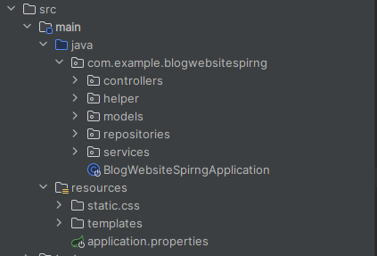
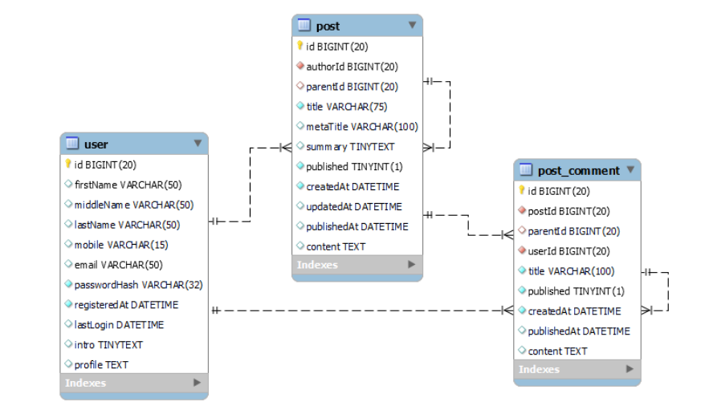
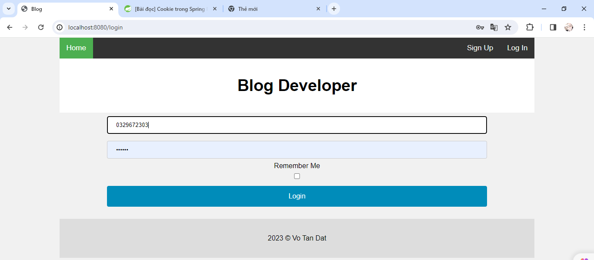
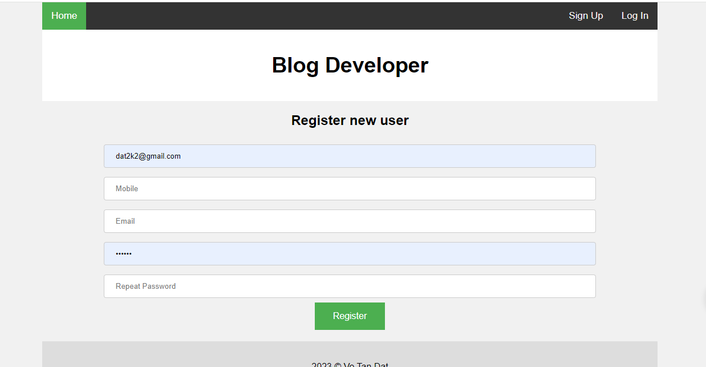
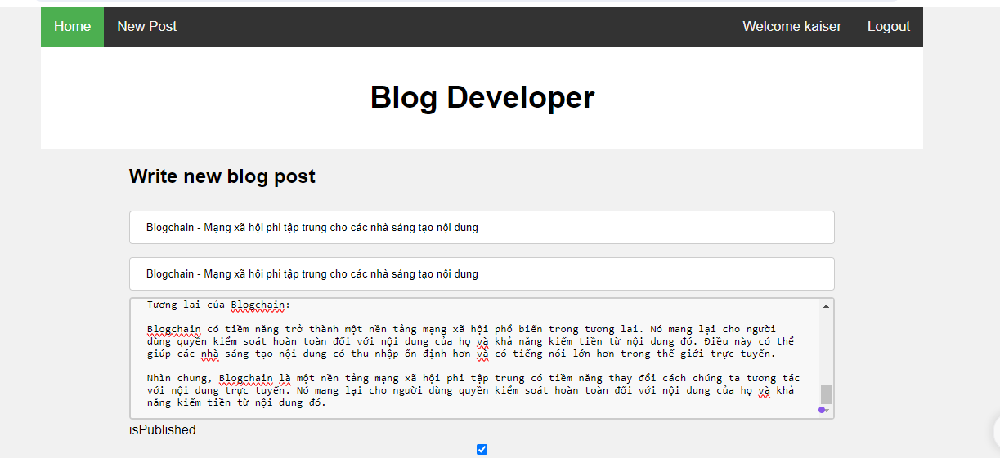
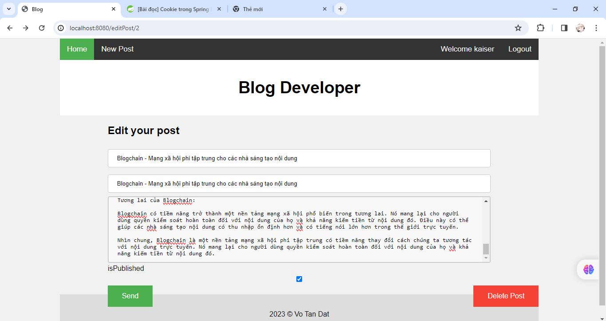
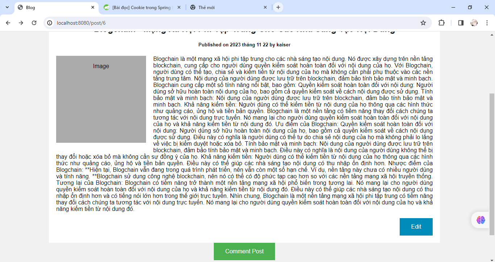
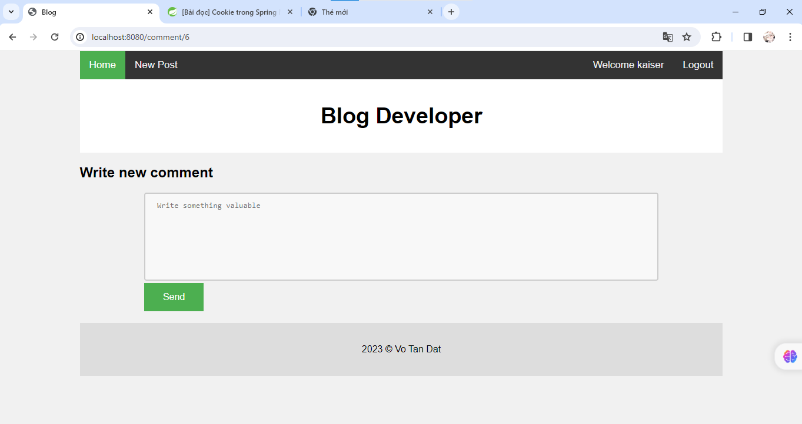

# spring-boot-recruitment

### Information:

Name: Võ Tấn Đạt
ID: 20116031
Subject: Lập trình WWW với công nghệ JAVA

### Description:

Bài tập lab06 week6

Yêu cầu: Viết một trang web Blog bằng SPRING MVC

## 1. Kiến trúc dự án

- Mô hình MVC

## 2. Cơ sở dữ liệu

## 3. Chức năng

- Đăng kí, Đăng nhập 
- Sử dụng cookies, session
- Đăng tải, chỉnh sửa, xoá post
- Comment bài post, chỉnh sửa
- Hiển thị list post
### 3.1 Chức năng đăng nhập

- Có thể dăng nhập bằng mobie hoặc gmail

### 3.2 Chức năng đăng kí

- Mật khẩu được mã hoá bằng thư viện BCrypt

### 3.3 Chức năng đăng tải post 
- User phải đăng nhập mới có thể tạo bài post 

### 3.4 Chức năng chỉnh sửa, xoá bài post đã đăng
- Chỉ có người tạo post mới có thể sửa post

### 3.5 Chức năng bình luận bài post
- Tại bài post muốn bình luận ta nhấn comment post 

- Tạo bình luận và nhấn send

## 4. Cách chạy dự án

- Clone dự án tại link này
- Mở dự án bằng IntelliJ
- Chọn services là Tomcat
- Bấm build để chạy dự án
- Mở trình duyện và xem dự án tại http://localhost:8080

## 5. Các công cụ đã sử dụng

- IDE : IntelliJ
-  Framework: Spring boot
- Web server : Tomcat
- Database server : MySQL
- Container : Docker (sử dụng docker để chạy MySQL)
- Storage code: GitHub

## 6. Lời cảm ơn

Cảm ơn bạn đã ghé thăm dự án của tôi <3
